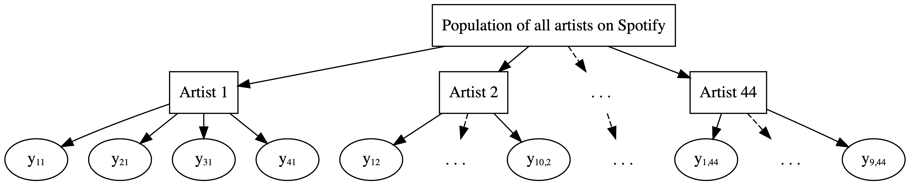

class: title-slide

```{r child = "../setup.Rmd"}
```

```{r echo=FALSE, message=FALSE}
library(bayesrules)
library(tidyverse)
library(rstanarm)
library(bayesplot)
library(janitor)
library(rstan)
library(broom.mixed)
```

<br>
<br>
.right-panel[ 

# `r rmarkdown::metadata$title`
## `r rmarkdown::metadata$author`
Examples from [bayesrulesbook.com](https://bayesrulesbook.com)

]


---

class: middle

## Data - Running

```{r}

data(cherry_blossom_sample)

running <- cherry_blossom_sample %>% 
  select(runner, age, net)
glimpse(running)
```

---

class: middle

```{r}
ggplot(running, aes(x = runner, y = net)) + 
  geom_boxplot()

```


---

class: middle

## Complete Pooling 


Complete pooling technique: combine all 252 observations across our 36 runners into one pool of information. 


```{r warning=FALSE, fig.height=4}
ggplot(running, aes(y = net, x = age)) + 
  geom_point()
```


---

class: middle

## Complete Pooling 


$$Y_i | \beta_0, \beta_1, \sigma \stackrel{ind}{\sim} N\left(\mu_i, \sigma^2\right) \;\; \text{ with } \;\; \mu_i = \beta_0 + \beta_1X_i$$

```{r cache=TRUE}
complete_pooled_model <- stan_glm(
  net ~ age, 
  data = running, family = gaussian, 
  prior_intercept = normal(0, 2.5, autoscale = TRUE),
  prior = normal(0, 2.5, autoscale = TRUE), 
  prior_aux = exponential(1, autoscale = TRUE),
  chains = 4, iter = 5000*2, refresh = 0, seed = 84735)
```


---

class: middle


```{r}
tidy(complete_pooled_model, conf.int = TRUE, conf.level = 0.80)
```

---

class: middle

```{r warning=FALSE, message=FALSE, fig.height=4}
# Plot of the posterior median model
ggplot(running, aes(x = age, y = net, group = runner)) + 
  geom_smooth(method = "lm", se = FALSE, color = "gray", size = 0.5) + 
  geom_abline(aes(intercept = 75.2, slope = 0.268), color = "blue")
```


---

```{r warning=FALSE, fig.height=3.5}
# Select an example subset
examples <- running %>% 
  filter(runner %in% c("1", "20", "22"))

ggplot(examples, aes(x = age, y = net)) + 
  geom_point() + 
  facet_wrap(~ runner) + 
  geom_abline(aes(intercept = 75.2242, slope = 0.2678), 
              color = "blue")
```

---

class: middle

1. Though the observations on one runner might be independent of those on another, the observations _within_ a runner are _correlated_. That is, how fast a runner ran in their previous race tells us something about how fast they'll run in the next. 
2. With respect to the relationship between running time and age, people are inherently different.

--

Framework of a complete pooled model:

```{r echo=FALSE, out.width="50%"}
knitr::include_graphics("img/complete_pool_diagram.png")
```

--

Drawbacks of a complete pooling approach:


1. we violate the assumption of independence; and, in turn,
2. we might produce misleading conclusions about the relationship itself and the significance of this relationship.

---

class: middle

## No pooling

```{r echo=FALSE, out.width="50%"}
knitr::include_graphics("img/complete_pool_diagram.png")
```

--

No pooling approach builds a _separate_ model for each runner.

--

Let $(Y_{ij}, X_{ij})$ denote the observed run times and age for runner $j$ in their $i$th race.
Then the data structure for the Normal linear regression model of run time vs age for runner $j$ is:


$$Y_{ij} | \beta_{0j}, \beta_{1j}, \sigma \sim N\left(\mu_{ij}, \sigma^2\right) \;\; \text{ with } \;\; \mu_{ij} = \beta_{0j} + \beta_{1j} X_{ij}$$

--

This model allows for each runner $j$ to have a unique intercept $\beta_{0j}$ and age coefficient $\beta_{1j}$.


---

class: middle

On the context of running, the no pooled models reflect the fact that some people tend to be faster than others (hence the different $\beta_{0j}$) and that _changes_ in speed over time aren't the same for everyone (hence the different $\beta_{1j}$).

---

class: middle


```{r warning=FALSE, fig.height=3.5, echo=FALSE}
ggplot(examples, aes(x = age, y = net)) + 
  geom_point() + 
  facet_wrap(~ runner) + 
  geom_abline(aes(intercept = 75.2242, slope = 0.2678), 
              color = "blue")
```

Based on this model, what do you anticipate that your running time will be at the age of 55?

---

class: middle

Drawbacks of a no pooling approach:

- We cannot reliably generalize or apply the group-specific no pooled models to groups outside those in our sample.
- No pooled models assume that one group doesn’t contain relevant information about another, and thus ignores potentially valuable information. This is especially consequential when we have a small number of observations per group.

---

class: middle

```{r echo=FALSE, out.width="70%"}
knitr::include_graphics("img/partial_pool_diagram.png")
```


**Examples**: Students within classrooms, patients within hospitals, different runs for each runner (longitudunal, repeated-measures)

---

class: middle

__Within-group variability__

The degree of the variability among multiple observations _within_ each group can be interesting on its own. For example, we can examine how _consistent_ an _individual's_ running times are from year to year.
    
--

__Between-group variability__
    
Hierarchical data also allows us to examine the variability from group to group. For example, we can examine the degree to which running patterns _vary_ from individual to individual.

---

class: middle

```{r}
data(spotify)

spotify <- spotify %>% 
  select(artist, title, popularity) %>% 
  mutate(artist = fct_reorder(artist, popularity, .fun = 'mean'))

glimpse(spotify)

nlevels(spotify$artist)
```

---

```{r}
artist_means <- spotify %>% 
  group_by(artist) %>% 
  summarize(count = n(), popularity = mean(popularity))

artist_means %>%
  slice(1:2, 43:44)
```

---

class: middle

```{r echo=FALSE, out.width="100%"}


```

---

class: middle

__Complete pooling__    

_Ignore_ artists and lump all songs together 

__No pooling__    

_Separately_ analyze each artist and assume that one artist's data doesn't contain valuable information about another artist 
    
__Partial pooling (via hierarchical models)__    

Acknowledge the grouping structure, so that even though artists differ in popularity, they might share valuable information about each other _and_ about the broader population of artists.
    

---

class: middle

## The hierarchy

Layer 1:

$Y_{ij} | \mu_j, \sigma_y   \hspace{-0.075in} \sim \text{model of how song popularity varies WITHIN artist } j$
--

Layer 2:

$\mu_j | \mu, \sigma_\mu  \hspace{-0.075in} \sim \text{model of how the typical popularity} \mu_j \text{varies BETWEEN artists}$
--

Layer 3:

$\mu, \sigma_y, \sigma_\mu   \hspace{-0.075in} \sim \text{prior models for shared global parameters}$


---

class: middle

- $\mu_j$ = mean song popularity for artist $j$; and
- $\sigma_y$ = __within-group variability__, i.e., the standard deviation in popularity from song to song within each artist.


---

class: middle

Popularity varies from artist to artist.
We model this variability in mean popularity __between__ artists by assuming that the individual mean popularity levels, $\mu_j$, are _Normally_ distributed around $\mu$ with standard deviation $\sigma_\mu$,\index{between-group variability}

$$\mu_j | \mu, \sigma_\mu \sim N(\mu, \sigma^2_\mu)  .$$

Thus, we can think of the two new parameters as follows:

- $\mu$ = the __global average__ of mean song popularity $\mu_j$ across all artists $j$, i.e., the mean popularity rating for the most average artist; and\index{global parameter}
- $\sigma_\mu$ = __between-group variability__, i.e., the standard deviation in mean popularity $\mu_j$ from artist to artist.

---

class: middle

```{r}
ggplot(artist_means, aes(x = popularity)) + 
  geom_density()
```


---

class: middle

__Notation alert__

- There's a difference between $\mu_j$ and $\mu$. When a parameter has a subscript $j$, it refers to a feature of group $j$. When a parameter _doesn't_ have a subscript $j$, it's the _global_ counterpart, i.e., the same feature across all groups.

- Subscripts signal the group or layer of interest. For example, $\sigma_y$ refers to the standard deviation of $Y$ values within each group, whereas $\sigma_\mu$ refers to the standard deviation of means $\mu_j$ from group to group.

---

class: middle

```{r cache=TRUE}
spotify_hierarchical <- stan_glmer(
  popularity ~ (1 | artist), 
  data = spotify, family = gaussian,
  prior_intercept = normal(50, 2.5, autoscale = TRUE),
  prior_aux = exponential(1, autoscale = TRUE),
  prior_covariance = decov(reg = 1, conc = 1, shape = 1, scale = 1),
  chains = 4, iter = 5000*2, seed = 84735, refresh=FALSE)

```

- To indicate that the `artist` variable defines the group structure of our data, as opposed to it being a predictor of `popularity`, the appropriate formula here is `popularity ~ (1 | artist)`.
- The prior for $\sigma_\mu$ is specified by `prior_covariance`. For this particular model, with only one set of artist-specific parameters $\mu_j$, this is equivalent to an Exp(1) prior. (We will learn more about `prior_covariance` next lecture).

---

class: middle


```{r fig.height=5}
pp_check(spotify_hierarchical) + 
  xlab("popularity")

```

---


class: middle

```{r}
# Store the simulation in a data frame
spotify_hierarchical_df <- as.data.frame(spotify_hierarchical)

# Check out the first 3 and last 3 parameter labels
spotify_hierarchical_df %>% 
  colnames() %>% 
  as.data.frame() %>% 
  slice(1:3, 45:47)
```

---

class: middle

## Posterior Analysis of Global Parameters

- $\mu$ = `(Intercept)`
- $\sigma_y$ = `sigma`
- $\sigma_\mu^2$ = `Sigma[artist:(Intercept),(Intercept)]`.This is not a typo. The default output gives us information about the _standard deviation_ within artists ( $\sigma_y$ ) but the _variance_ between artists ( $\sigma_\mu^2$ ).

---


class: middle

```{r}
tidy(spotify_hierarchical, effects = "fixed", 
     conf.int = TRUE, conf.level = 0.80)
```

```{r echo = FALSE}
post_sum <- tidy(spotify_hierarchical, effects = "fixed", 
                 conf.int = TRUE, conf.level = 0.80)
post_sum_sig <- tidy(spotify_hierarchical, effects = "ran_pars",
                     conf.int = TRUE, conf.level = 0.80)
```

Pay attention to `effects = fixed`, where "fixed" is synonymous with "non-varying" or "global."

Per the results, there's an 80% chance that the _average_ artist has a mean popularity rating between `r round(post_sum[1,4],1)` and `r round(post_sum[1,5],1)`.

---

class: middle

To call up the posterior medians for $\sigma_y$ and $\sigma_\mu$, we can specify `effects = "ran_pars"`, i.e., `par`ameters related to `ran`domness or variability:

```{r}
tidy(spotify_hierarchical, effects = "ran_pars")
```

The posterior median of $\sigma_y$ (`sd_Obervation.Residual`) suggests that, _within_ any given artist, popularity ratings tend to vary by `r round(post_sum_sig[2,3],1)` points _from song to song_.
The _between_ standard deviation $\sigma_\mu$ (`sd_(Intercept).artist`) tends to be slightly higher at around `r round(post_sum_sig[1,3],1)`.
Thus, the _mean_ popularity rating tends to vary by `r round(post_sum_sig[1,3],1)` points _from artist to artist_.


---

class: middle

$$\text{Cor}(Y_{ij}, Y_{kj}) = \frac{\sigma^2_\mu}{\sigma^2_\mu + \sigma^2_y}$$

---

class: middle

These two sources of variability suggest that the popularity levels among multiple songs _by the same artist_ tend to have a moderate correlation near 0.54.

```{r}
15.1^2 / (15.1^2 + 14.0^2)
```

```{r echo = FALSE}
ratio <- round(round(post_sum_sig[1,3],1)^2 / (round(post_sum_sig[1,3],1)^2 + round(post_sum_sig[2,3],1)^2)*100)
```

--


Thinking of this another way, `r ratio`% of the variability in song popularity is explained by differences between artists, whereas `r 100-ratio`% is explained by differences among the songs within each artist:

```{r}
14.0^2 / (15.1^2 + 14.0^2)
```

---
